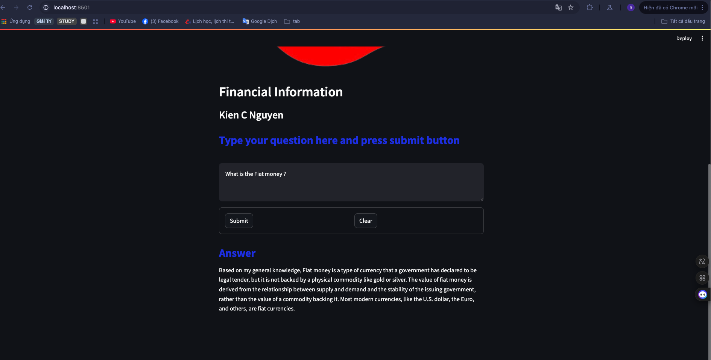

## Phạm Chí Nguyên - Lab 2

## Run

- clone Repo
- Add key  .dp_lab2-main/secrets
- Run code in dp_lab2-main/Rag_Data/qa_data_prep.ipynb
- cd dp_lab2-main
- docker compose up --build
- Frontend : http://localhost:8501/
- Test BackEnd : 
    + http://0.0.0.0:8000/query
    + schema : { "input_text": "Your question" }

